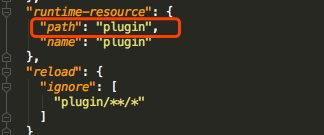
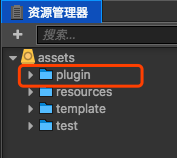

# 插件打包
使用之前,记得首先安装gulp,然后
```
npm i 
```
安装必要的node模块

## 说明
使用gulp的**打包插件**自动化打包过程中,task处理的流程:
### 1. 优化package.json 
在打包过程中,task修改了插件的package.json插件配置文件,删除了开发过程中使用到的插件自定义菜单.

如果不想让某个菜单在最终打包过程中出现,那么只需要在该插件上定义
```
"del": true,
```
打包后的package.json将删除这个菜单

示例插件配置文件


从配置中可以看到
```json
{
    "TEST/测试面板":{
      "del": true,
      "message":"test-plugin:open-test"
    }
}
```
### 2. 将项目根目录的README.md打包进压缩包
如果插件需要来一份使用说明,那么可以写在项目的README.md中,最后会一同打进压缩包里面.
### 3. 处理插件的runtime-resource
这也是使用task打包插件的一个重要原因,因为runtime-resource一般来说是放在插件自身的某个目录,当creator加载插件的时候,会在资源管理其中映射一份runtime-resource,作为项目的组成部分存在,唯一不同的是runtime-resource是只读属性,不允许任何修改.

那么问题就来了,开发插件的过程中,runtime-resource肯定要修修改改,如果放在插件runtime-resource配置的路径下,creator的机制又不允许修改,所以,不得不重新拷贝到assets下,编辑完成之后,在发布的时候,再重新拷贝到runtime-resource的配置目录下,而目前官方也是推荐这种方式去开发runtime-resource部分的逻辑.

于是,该task就应运而生,把这部分机械的文件拷贝工作交给task来处理,这样,只需要把runtime-resource当做正常的assets来进行开发维护进行了,需要注意的是,要保证所有的runtime-resource要保证在一个目录下,而且名字要和配置中的path一直,如图所示:

package.json的配置    


assets的配置    


### 最终插件打包后的目录结构
- 插件压缩包根目录
    - 插件说明.txt
    - 插件根目录
        - package.json
        - main.js

### 最后
该task仅仅解决了个人开发插件过程中遇到的问题,如果有更好的建议,欢迎交流,QQ群**224756137**,插件小王子在这里等着你哦!